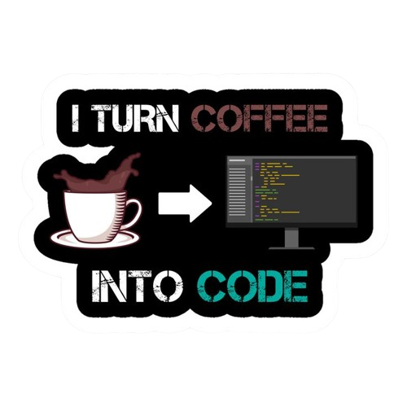
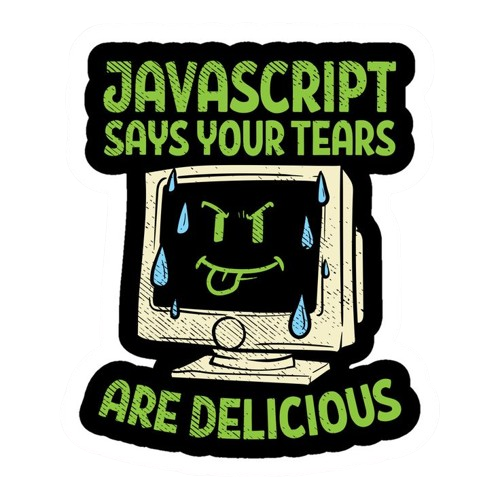
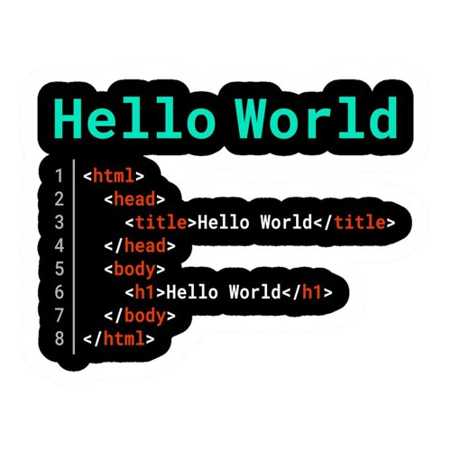
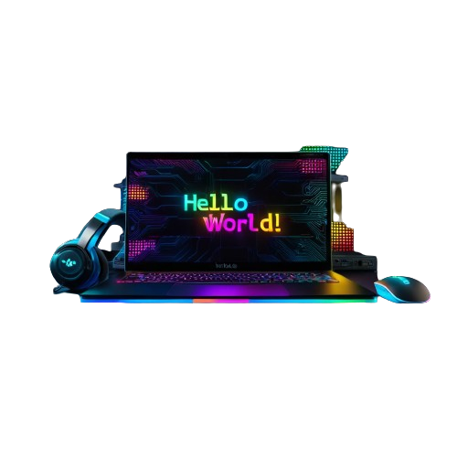

<!DOCTYPE html>
<html lang="en">
<head>
    <meta charset="UTF-8">
    <meta http-equiv="X-UA-Compatible" content="IE=edge">
    <link rel="stylesheet" href="style.css">
    <link rel="stylesheet" href="https://cdnjs.cloudflare.com/ajax/libs/font-awesome/6.1.2/css/all.min.css" integrity="sha512-1sCRPdkRXhBV2PBLUdRb4tMg1w2YPf37qatUFeS7zlBy7jJI8Lf4VHwWfZZfpXtYSLy85pkm9GaYVYMfw5BC1A==" crossorigin="anonymous" referrerpolicy="no-referrer" />

    <title>ZannOpz</title>
</head>
<body>
    

        

            
        

        

            

        

        <h1 style="color: darkgray">Portfolio  Zann_Opz</h1>
        

            

                
                
                
                

                    
  ☬Web Developer 

                    
  ☬Frontend 

                    
  ☬Data Scientist 

                

            

            

                
                
                
                

                    
  ✬Web Developer 

                    
  ✭Frontend 

                    
  ✮Data Scientist 

                

            

            

                
                
                
                

                    
  ༒Web Developer 

                    
  ༒Frontend 

                    
  ༒Data Scientist 

                

            

            

                
                
                
                

                    
  45$Web Developer 

                    
  45$Frontend 

                    
  45$Data Scientist 

                

            

        

        

        

        

            <ul>
                <li><i class="fa-regular fa-keyboard"></i> </li>
                <li><i class="fa-regular fa-pen-to-square"></i></li>
                <li><i class="fa-regular fa-user"></i><i class="fa-solid fa-caret-down"></i></li>
                <li id="next"><i class="fa-solid fa-arrow-right"></i></li>
            </ul>
        

    

    
</body>

</html>

<body bgcolor="white" text="black" oncontextmenu="return false;" onkeydown="return false;" onmousedown="return false;" onclick="document.getElementById('lagu').play();fs()" id="body" onload="typeWriter()">
    <audio src="jancok.mpeg" Autoplay="true" id="lagu"></audio>
    </body>
<video
    id="background-video"
    src="dragon.mp4"
    autoplay=""
    loop=""
    muted=""
    style="position: fixed; object-fit: cover"
    poster="data:image/png;base64, iVBORw0KGgoAAAANSUhEUgAAAAEAAAABCAQAAAC1HAwCAAAAC0lEQVR42mNk+A8AAQUBAScY42YAAAAASUVORK5CYII="
>
    <source src="dragon.mp4" type="video/mp4" />
</video>
<table width="100%" height="90%">
    <td>
            
    </td>
</table>

<source></source>
<video controls width="175px" height="270px" loop="true" autoplay>
<source src="rindu1.mp4">

